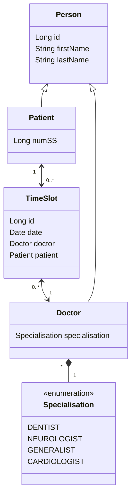

# Projet TP JPA 2021 UniR

Arnaud DELOURMEL (arnaud.delourmel@etudiant.univ-rennes1.fr)    
Tom ROUSSEAU (tom.rousseau@etudiant.univ-rennes1.fr)

---

### Introduction

Dans le cadre de l'unité d'enseignement Techniques Avancées pour les Architectures logicielle (TAA) nous devions construire et exposer une API à l'aide d'outils technologiques qui nous étaient fournis.
Notre projet se base sur le système de prise de rendez-vous médical Doctolib.
Notre architecture d'API se base principalement sur REST et le framework Spring Boot.

---

### Utilisation

Lancer la connexion à la base de donnée (HSQLDB) :

`$ ./run-hsqldb-server.sh`

Lancer le logiciel affichant la base de donnée :

`$ ./show-hsqldb.sh`

Identifiant pour se connecter à la base de donnée :

`jdbc:hsqldb:hsql://localhost/`

URL pour pointer sur notre API :

`http://localhost:8080/`

URL pour accéder à la documentation de notre API :

`http://localhost:8080/swagger-ui.html`

#### Exemple de requêtes

- Créer un docteur :
  `http://localhost:8080/doctor` avec comme paramètre un body JSON de ce type
    ```
    {
        "firstName" : "TITI",
        "lastName" : "TOTO",
        "specialisation" : "DENTIST"
    }
    ```

- Assigner un time slot à un patient :
  `http://localhost:8080/slot/newTimeSlot` avec comme paramètre un body JSON de ce type
    ```
        "doctor" : 1,
        "patient" : 2,
        "date" : "2022-10-20T10:00:00"
    ```

Pour plus d'exemples de requêtes, consulter la partie **Postman** du rapport.

---

### Postman

Vous trouverez dans le projet un fichier `requests_postman.json`. Ce fichier contient différentes requêtes pour tester le projet.


---

### L'architecture

Notre application se base donc sur une prise de rendez-vous médical entre un patient et un docteur. À chaque patient et docteur est donné un prénom et un nom de famille en étendant la classe `Person`. Au patient est rajouté un numéro de sécurité social, et au doctor une spécialisation.

Lorsqu'un docteur est créé, il choisi de créer avec lui une liste de rendez-vous entre deux dates chosis, nommé `TimeSlot`. Chaque rendez-vous contient une date, un docteur et un patient.

Diagramme UML :


---

### Partie front-end

La partie front-end a été réalisé avec React. Cependant nous n'avons pas eu le temps de finaliser cette partie. Actuellement, il est uniquement possible de consulter les médecins présent dans la base de données et d'ajouter un nouveau médecin


Pour lancer le front-end il est nécessaire d'avoir npm et node d'installer sur votre machine. Ensuite, il suffit d'exécuter les commandes suivantes :

```bash
$ npm install
$ npm start
```

Le front-end sera accessible à l'URL : http://localhost:3000

:warning: : Le front-end doit impérativement fonctionner sur l'url précisé ci-dessus. En effet, pour éviter les erreurs [CORS](https://developer.mozilla.org/fr/docs/Web/HTTP/CORS/Errors) dans le back-end nous avons renseigné l'URL du front-end 

