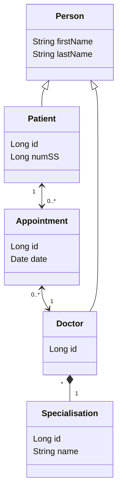

# Template de projet pour le TP JPA 2021 UniR

**TODO**
- Ajouter profs au git

**Pour le rapport** :
- ajouter l'archi UML
- description rapide des classes et des choix spécifiques
- description de l'API (sauf si swagger bien annoté)
- exemple de requête (ou fournir export de la confid postman)
- si front, expliquer comment le lancer et l'utiliser
- config KeyClock

*RAPPORT A RENDRE LE : 09/10*

---

Connect to DB :
jdbc:hsqldb:hsql://localhost/

---

Diagram (work in progress) :

Edited on Mermaid :
[Mermaid Doc](https://mermaid-js.github.io/mermaid/#/classDiagram)  | 
[Mermaid Live Editor](https://mermaid.live)

---
