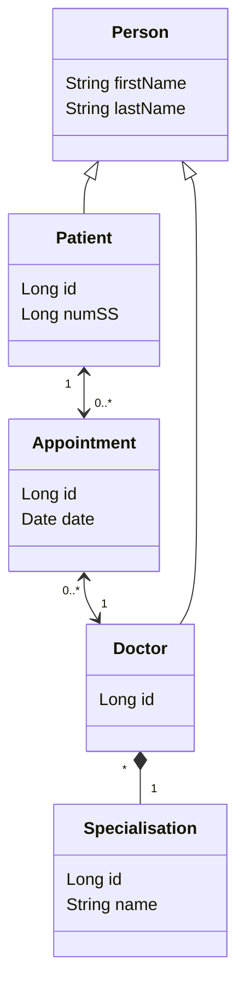

# Template de projet pour le TP JPA 2021 UniR

**TODO**
- Ajouter profs au git

---

Connect to DB :
jdbc:hsqldb:hsql://localhost/

---

Diagram (work in progress) :

Edited on Mermaid :
[Mermaid Doc](https://mermaid-js.github.io/mermaid/#/classDiagram)  | 
[Mermaid Live Editor](https://mermaid.live)

---
