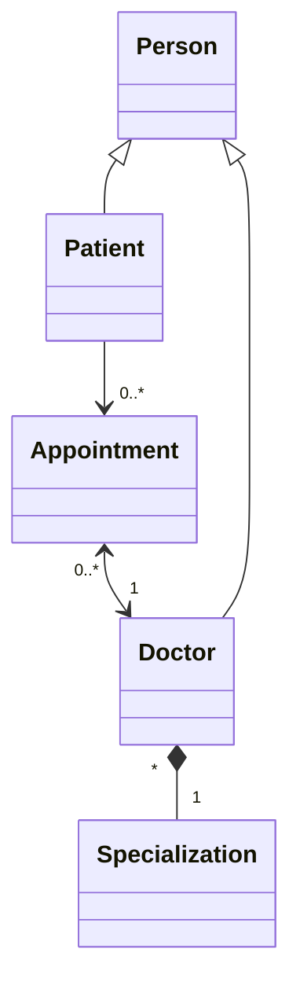

# Template de projet pour le TP JPA 2021 UniR

- Ajouter profs au git
- Héritage et au moins une 1-*

---

Diagram (work in progress) :

Edited on Mermaid :
[Mermaid Doc](https://mermaid-js.github.io/mermaid/#/classDiagram)  | 
[Mermaid Live Editor](https://mermaid.live)

---
